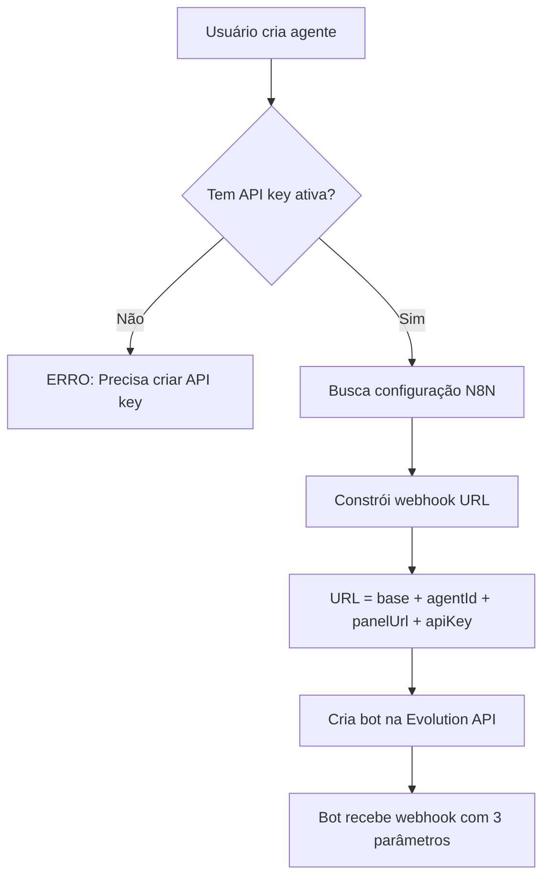
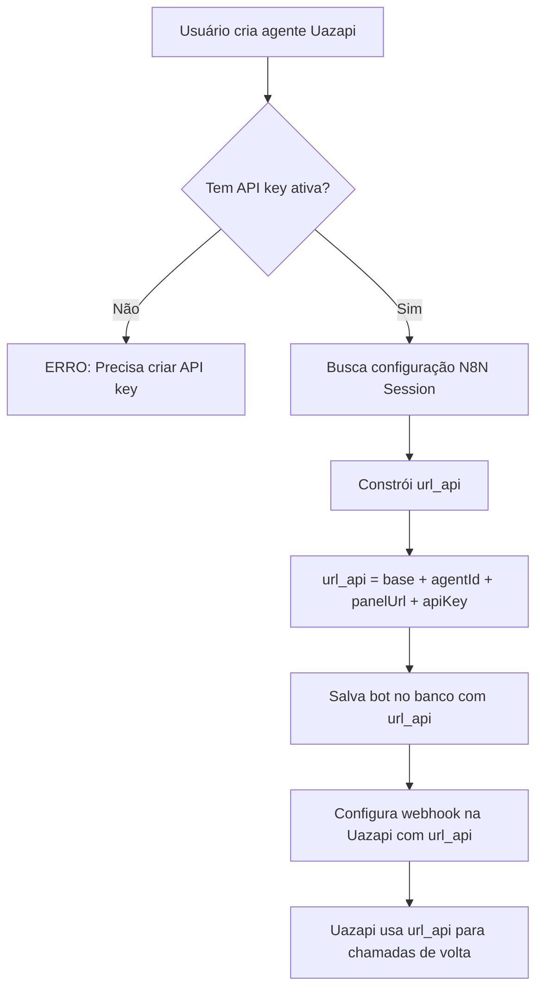

# 🔐 Evolution Bot: Panel URL e API Key Integration

## 📋 Resumo das Alterações

Foi implementado o suporte para incluir **panel URL** e **API key** no webhook do Evolution Bot, permitindo que o bot da Evolution API possa se comunicar de volta com o painel de forma autenticada.

## 🎯 O que foi implementado?

### 1. Formato do Webhook URL

#### Evolution Bot
**ANTES:**
```
n8n_ia_direta?agentId=xxx
```

**DEPOIS:**
```
n8n_ia_direta?agentId=xxx&panelUrl=https://seu-painel.com&apiKey=sk_xxxxx
```

#### Uazapi (campo `url_api`)
**ANTES:**
```
n8n_session?botId=xxx
```

**DEPOIS:**
```
n8n_session?botId=xxx&agentId=yyy&panelUrl=https://seu-painel.com&apiKey=sk_xxxxx
```

> ⚠️ **Importante sobre Uazapi**: A modificação é feita **apenas no campo `url_api`** que vai para o banco de dados e para a API da Uazapi. NÃO afeta a URL de comunicação interna com a Uazapi.

### 2. Validação Obrigatória de API Key
Agora é **OBRIGATÓRIO** ter uma API key ativa antes de criar um agente. Se o usuário tentar criar um agente sem uma API key, receberá a seguinte mensagem:

**Para Admin:**
```
"É necessário criar uma API key antes de criar um agente. Vá para 'Gerenciar API Keys' e crie uma chave de API ativa."
```

**Para Usuário:**
```
"É necessário criar uma API key antes de criar um agente. Vá para 'Configurações > API Keys' e crie uma chave de API ativa."
```

### 3. Arquivos Modificados

#### Criação de Agentes (POST)

**Evolution Bot:**
1. **`app/api/admin/agents/route.ts`** (linha ~560)
   - Busca API key ativa do usuário
   - Valida existência da API key (bloqueia criação se não existir)
   - Constrói webhook URL com `agentId`, `panelUrl` e `apiKey`
   - Aplica tanto para N8N webhook quanto fallback webhook

2. **`app/api/user/agents/route.ts`** (linha ~570)
   - Mesma lógica da rota admin
   - Validação obrigatória de API key antes de criar agente

**Uazapi:**
3. **`app/api/admin/agents/route.ts`** (linha ~355)
   - Busca API key ativa do usuário para Uazapi
   - Valida existência da API key (bloqueia criação se não existir)
   - Constrói `url_api` com `agentId`, `panelUrl` e `apiKey`
   - Salva no banco de dados e envia para API da Uazapi

4. **`app/api/user/agents/route.ts`** (linha ~355)
   - Mesma lógica da rota admin para Uazapi
   - Validação obrigatória de API key antes de criar agente Uazapi

#### Atualização de Agentes (PUT)
3. **`app/api/admin/agents/route.ts`** (linha ~780)
   - Busca API key ativa ao atualizar
   - Atualiza webhook URL com novos parâmetros
   - Mantém aviso se não encontrar API key (não bloqueia update)

4. **`app/api/user/agents/[id]/route.ts`** (linha ~300)
   - Busca API key ativa ao atualizar
   - Atualiza webhook URL com novos parâmetros
   - Mantém aviso se não encontrar API key (não bloqueia update)

5. **`app/api/admin/agents/[id]/route.ts`** (linha ~390)
   - Busca API key ativa ao atualizar
   - Constrói webhook URL com lógica de separador correto
   - Mantém aviso se não encontrar API key (não bloqueia update)

## 🔍 Detalhes Técnicos

### Qual API Key é usada?

🔑 **API Key do Painel** (tabela `user_api_keys`)
- **NÃO é** a API key da LLM (OpenAI, Anthropic, etc)
- É a chave de autenticação do **painel IMPA AI**
- Permite que Evolution Bot/Uazapi façam requisições autenticadas de volta ao painel
- Criada em `/admin/apikeys` ou `/dashboard/settings?tab=api-keys`

### Como funciona a busca de API Key?

```typescript
const apiKeyResponse = await fetch(
  `${supabaseUrl}/rest/v1/user_api_keys?select=api_key&user_id=eq.${user_id}&is_active=eq.true&order=created_at.desc&limit=1`,
  { headers }
);
```

**Critérios:**
- Busca pela tabela `user_api_keys` (API keys do painel)
- Filtra por `user_id` do agente sendo criado/atualizado
- Apenas API keys **ativas** (`is_active=true`)
- Ordenado por data de criação (mais recente primeiro)
- Retorna apenas **1 resultado** (a mais recente)

### Construção do Webhook URL

#### Evolution Bot (webhook URL)
```typescript
let webhookUrl;
if (n8nWebhookUrl) {
  webhookUrl = `${n8nWebhookUrl}?agentId=${agentId}`;
  if (userApiKey) {
    webhookUrl += `&panelUrl=${encodeURIComponent(baseUrl)}&apiKey=${encodeURIComponent(userApiKey)}`;
  }
} else {
  webhookUrl = `${baseUrl}/api/agents/webhook?agentId=${agentId}`;
  if (userApiKey) {
    webhookUrl += `&panelUrl=${encodeURIComponent(baseUrl)}&apiKey=${encodeURIComponent(userApiKey)}`;
  }
}
```

#### Uazapi (campo `url_api`)
```typescript
let botUrlApi;
if (n8nWebhookUrl) {
  botUrlApi = `${n8nWebhookUrl}?agentId=${agentId}`;
  if (userApiKey) {
    botUrlApi += `&panelUrl=${encodeURIComponent(baseUrl)}&apiKey=${encodeURIComponent(userApiKey)}`;
  }
} else {
  botUrlApi = `${baseUrl}/api/agents/webhook?agentId=${agentId}`;
  if (userApiKey) {
    botUrlApi += `&panelUrl=${encodeURIComponent(baseUrl)}&apiKey=${encodeURIComponent(userApiKey)}`;
  }
}
```

**Variáveis:**
- `baseUrl`: Obtido de `process.env.NEXTAUTH_URL` (URL do painel)
- `agentId`: ID do agente criado
- `userApiKey`: API key do painel (tabela `user_api_keys`) mais recente e ativa do usuário
- `n8nWebhookUrl`: URL do webhook N8N (se configurado)

**Encoding:**
- `panelUrl` e `apiKey` são **URL encoded** para evitar problemas com caracteres especiais

**Diferença Uazapi:**
- A URL é salva no campo `url_api` da tabela `bots`
- Essa mesma URL é enviada para a API da Uazapi no webhook
- NÃO afeta a comunicação interna do sistema com a Uazapi

## ⚠️ Importante: Diferença entre Criação e Atualização

### Criação de Agente (POST)
- **BLOQUEIO:** Se não existir API key, o agente **NÃO É CRIADO**
- **Mensagem:** Erro claro indicando que é necessário criar uma API key primeiro
- **Motivo:** Novos agentes devem sempre ter API key configurada

### Atualização de Agente (PUT)
- **AVISO:** Se não existir API key, apenas loga um warning
- **Comportamento:** Agente é atualizado normalmente
- **Motivo:** Agentes antigos podem não ter API keys ainda, e não queremos quebrar a funcionalidade existente

## 📊 Fluxo Completo

### Evolution Bot


### Uazapi


## 🧪 Como Testar

### 1. Criar API Key do Painel
```bash
# Admin: /admin/apikeys
# Usuário: /dashboard/settings (se disponível)
# Esta é a API key do PAINEL, não da LLM!
```

### 2. Criar Agente Evolution Bot
```bash
# O agente será criado apenas se houver API key ativa
POST /api/admin/agents ou /api/user/agents
# Com api_type = "evolution"
```

### 3. Criar Agente Uazapi
```bash
# O agente será criado apenas se houver API key ativa
POST /api/admin/agents ou /api/user/agents
# Com api_type = "uazapi"
```

### 4. Verificar URLs Geradas

**Evolution Bot (campo `apiUrl` no bot):**
```bash
# Exemplo:
# https://n8n.exemplo.com/webhook?agentId=xxx&panelUrl=https://painel.com&apiKey=sk_...
```

**Uazapi (campo `url_api` na tabela `bots`):**
```bash
# Exemplo:
# https://n8n.exemplo.com/session?agentId=xxx&panelUrl=https://painel.com&apiKey=sk_...
```

### 5. Testar sem API Key
```bash
# Deve retornar erro 500 com mensagem clara
# Admin: "É necessário criar uma API key antes de criar um agente. Vá para 'Gerenciar API Keys'..."
# User: "É necessário criar uma API key antes de criar um agente. Vá para 'Configurações > API Keys'..."
```

## 📝 Logs para Debug

Os seguintes logs foram adicionados para facilitar o debug:

**Evolution Bot:**
```
🔍 Buscando API key ativa do usuário...
✅ API key do usuário encontrada
📌 Webhook URL construída: <url-completa>
⚠️ Nenhuma API key ativa encontrada para o usuário
❌ Erro com API key do usuário: <mensagem>
```

**Uazapi:**
```
🔍 [UAZAPI] Buscando API key ativa do usuário...
✅ [UAZAPI] API key do usuário encontrada
📌 [UAZAPI] URL API construída: <url-completa>
⚠️ [UAZAPI] Nenhuma API key ativa encontrada para o usuário
❌ [UAZAPI] Erro com API key do usuário: <mensagem>
```

## 🔗 Referências

- **Tabela de API Keys do Painel:** `user_api_keys` (NÃO é `llm_api_keys`)
- **Variável de Ambiente:** `NEXTAUTH_URL` (URL base do painel)
- **Evolution Bot API:** Webhook recebe `agentId`, `panelUrl` e `apiKey`
- **Uazapi:** Campo `url_api` na tabela `bots` recebe `agentId`, `panelUrl` e `apiKey`

---

## ⚠️ Importantes Esclarecimentos

### 1. Qual API Key é usada?
- ✅ **API Key do Painel** (`user_api_keys`)
- ❌ **NÃO é** a API Key da LLM (`llm_api_keys`)

### 2. O que muda na Uazapi?
- ✅ **Campo `url_api`** que vai para o banco e para a API da Uazapi
- ❌ **NÃO muda** a URL de comunicação interna do sistema com a Uazapi

### 3. Por que precisa de API Key?
- Permite que Evolution Bot/Uazapi façam **requisições autenticadas** de volta ao painel
- Aumenta a **segurança** das comunicações
- Permite **rastreabilidade** das chamadas

---

## ✅ Status

- [x] Adicionar panelUrl e apiKey ao webhook URL (Evolution Bot)
- [x] Adicionar panelUrl e apiKey ao url_api (Uazapi)
- [x] Validar existência de API key antes de criar agente
- [x] Atualizar todas as rotas de criação e atualização
- [x] Adicionar logs de debug
- [x] Documentar mudanças
- [x] Esclarecer diferença entre API keys do painel e da LLM

**Data:** 17 de Novembro de 2025
**Autor:** GitHub Copilot
**Versão:** 2.0.0
