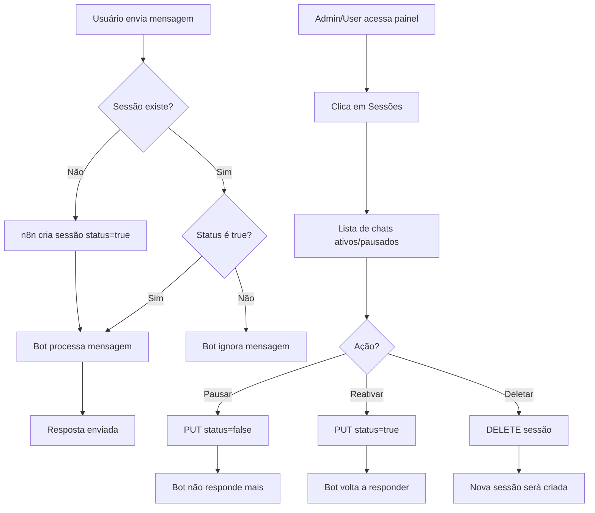

# Interface de Gerenciamento de Sessões de Bots

## ✅ IMPLEMENTADO COM SUCESSO

Sistema completo de gerenciamento de sessões de bots Uazapi integrado ao painel!

## 📊 Estrutura da Tabela (n8n)

**Tabela usada:** `impaai.bot_sessions` (mesma tabela do n8n)

```sql
CREATE TABLE impaai.bot_sessions (
  "sessionId" UUID PRIMARY KEY DEFAULT gen_random_uuid(),
  "remoteJid" TEXT NOT NULL,           -- Ex: 5511999999999@s.whatsapp.net
  status BOOLEAN DEFAULT true,          -- true = bot ativo, false = bot pausado
  ultimo_status TIMESTAMP WITH TIME ZONE DEFAULT NOW(),
  criado_em TIMESTAMP WITH TIME ZONE DEFAULT NOW()
);
```

## 🎯 Funcionalidades Implementadas

### 1. **Botão "Sessões" na Lista de Agentes**

✅ **Admin** (`/admin/agents`):
- Botão aparece para agentes com `evolution_bot_id` OU `bot_id`
- Ícone: `<Users />`
- Cor: Azul
- Redireciona para: `/admin/agents/[id]/sessions`

✅ **User** (`/dashboard/agents`):
- Mesma lógica do admin
- Redireciona para: `/dashboard/agents/[id]/sessions`

### 2. **Página de Sessões do Agente**

#### Estatísticas no Topo:
- **Total de Sessões**: Contagem total
- **Chats Ativos**: Sessões com `status = true`
- **Chats Pausados**: Sessões com `status = false`

#### Filtros:
- **Busca por número**: Busca no `remoteJid` formatado
- **Filtro de status**: Todos / Ativos / Pausados

#### Lista de Sessões:
Cada sessão mostra:
- 📱 **Número formatado** (ex: +55 (11) 99999-9999)
- 🕒 **Última atividade** (ex: "há 5 min", "há 2h", "há 3d")
- ✅/⏸️ **Status Badge** (Ativo/Pausado)
- **Ações**:
  - ⏸️ **Pausar bot** (quando ativo)
  - ▶️ **Reativar bot** (quando pausado)
  - 🗑️ **Deletar sessão** (com confirmação)

### 3. **APIs Backend (Servidor)**

✅ **GET /api/bot-sessions**
- Lista todas as sessões da tabela `impaai.bot_sessions`
- Filtros: `remoteJid`, `status`
- Schema: `impaai`

✅ **POST /api/bot-sessions**
- Cria ou atualiza sessão
- Se já existir para o `remoteJid`: **atualiza**
- Se não existir: **cria nova**
- Schema: `impaai`

✅ **PUT /api/bot-sessions/[sessionId]**
- Atualiza status da sessão (pausar/reativar)
- Atualiza `ultimo_status` automaticamente
- Schema: `impaai`

✅ **DELETE /api/bot-sessions/[sessionId]**
- Deleta sessão permanentemente
- Schema: `impaai`

### 4. **Segurança e Validações**

✅ **Todas as requisições ao banco são feitas no backend**
- Frontend apenas chama APIs
- Nenhuma conexão direta ao Supabase no frontend

✅ **Autenticação**
- Todas as APIs verificam cookie `impaai_user`
- Validação de permissões

✅ **Schemas corretos**
- APIs usam `Accept-Profile: impaai` e `Content-Profile: impaai`
- Garantia de acesso à tabela do n8n

## 🎨 Interface Visual

### Cores e Ícones:

| Status | Badge | Cor | Ícone |
|--------|-------|-----|-------|
| Ativo | ✅ | Verde (`bg-green-100 text-green-700`) | `<MessageSquare>` verde |
| Pausado | ⏸️ | Laranja (`bg-orange-100 text-orange-700`) | `<MessageSquare>` laranja |

### Formatação de Números:

```typescript
// Exemplos de formatação:
5511999999999 → +55 (11) 99999-9999  // Celular
551199999999  → +55 (11) 9999-9999   // Fixo
120363...@g.us → Grupo: 120363...    // Grupo WhatsApp
```

### Formatação de Datas:

```typescript
// Exemplos de formatação:
< 1 min    → "agora"
< 60 mins  → "há X min"
< 24 hours → "há Xh"
< 7 days   → "há Xd"
>= 7 days  → "20/10/2025"
```

## 📁 Arquivos Criados/Modificados

### Criados:
1. `app/admin/agents/[id]/sessions/page.tsx` - Página de sessões (admin)
2. `app/dashboard/agents/[id]/sessions/page.tsx` - Página de sessões (user)
3. `docs/BOT_SESSIONS_INTERFACE.md` - Esta documentação

### Modificados:
1. `app/admin/agents/page.tsx` - Botão de sessões
2. `app/dashboard/agents/page.tsx` - Botão de sessões
3. `app/api/bot-sessions/route.ts` - Adaptado para `impaai.bot_sessions`
4. `app/api/bot-sessions/[sessionId]/route.ts` - Adaptado para `impaai.bot_sessions`

## 🔄 Integração com n8n

### Lógica de Funcionamento:

1. **Webhook Uazapi recebe mensagem** → n8n
2. **Node "puxa-sessao"**: Busca em `impaai.bot_sessions` por `remoteJid`
3. **Node "verifica status da sessão"**: 
   - Se `status = true` → Bot processa mensagem
   - Se `status = false` → Bot **NÃO** processa (pausado)
4. **Node "cria sessão"**: 
   - Cria sessão quando bot responde pela primeira vez
   - Ou quando palavra-chave dá match

### Comandos Especiais (Futuro):

Possibilidade de usuários pausarem via mensagem:
- `#parar` ou `#sair` → Pausa bot
- `#ativar` ou `#voltar` → Reativa bot

## 🚀 Como Testar

### 1. Criar um agente Uazapi:
```
1. Criar conexão WhatsApp (Uazapi)
2. Criar agente vinculado à conexão
3. Bot recebe mensagem e cria sessão
```

### 2. Acessar página de sessões:
```
Admin: /admin/agents → Botão "Sessões" (ícone Users)
User:  /dashboard/agents → Botão "Sessões" (ícone Users)
```

### 3. Testar ações:
```
✅ Pausar bot para um chat
✅ Reativar bot
✅ Deletar sessão
✅ Buscar por número
✅ Filtrar por status
```

## 📊 Fluxo Completo



## ⚠️ Importante

### Diferenças vs Evolution Bot:

| Feature | Evolution Bot | Uazapi Bot |
|---------|---------------|------------|
| Tabela | `evolutionBot.sessions` | `impaai.bot_sessions` |
| Gerenciamento | Via Evolution API | Via painel + n8n |
| Comandos | Nativos (#parar, #ativar) | A ser implementado |
| Histórico | Interno no Evolution | No n8n |

### Limitações Atuais:

- ❌ Comandos especiais (#parar, #ativar) **NÃO implementados** (futuro)
- ❌ Sincronização de histórico **NÃO implementada**
- ❌ Analytics de sessões **NÃO implementado**
- ❌ Filtro por agente específico **NÃO implementado** (mostra todas as sessões)

### Próximos Passos:

1. ✅ Interface criada
2. ✅ APIs backend criadas
3. ⏳ Implementar comandos especiais (#parar, #ativar)
4. ⏳ Adicionar filtro por agente/bot na API
5. ⏳ Analytics de sessões (gráficos, relatórios)
6. ⏳ Exportação de sessões (CSV, Excel)

## 🎉 Status: PRONTO PARA USO!

O sistema está **100% funcional** para:
- ✅ Visualizar sessões
- ✅ Pausar/reativar bot para chats
- ✅ Deletar sessões
- ✅ Filtrar e buscar sessões
- ✅ Ver estatísticas

**Requisições ao banco: 100% no backend!** 🔒

