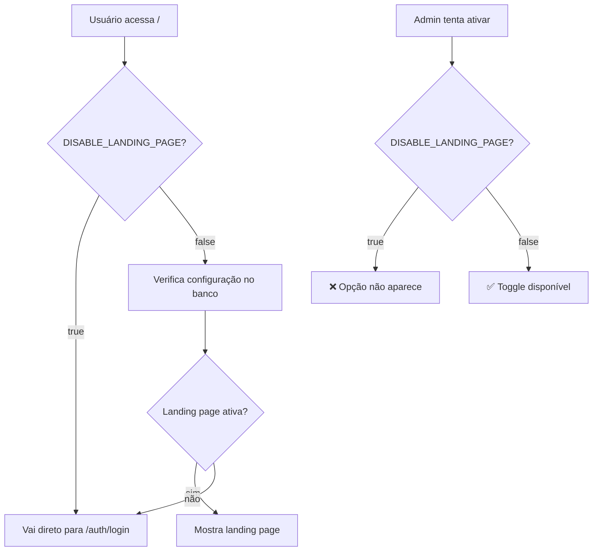

# 🚫 Desabilitando a Landing Page para Clientes Específicos

## 📝 Visão Geral

Para clientes que **não podem ter acesso à landing page de forma alguma**, o sistema oferece uma configuração especial via variável de ambiente que desabilita completamente esta funcionalidade.

## ⚙️ Como Configurar

### 1. 🔧 Adicionar Variável de Ambiente

No arquivo `.env` do cliente, adicione:

```bash
DISABLE_LANDING_PAGE=true
```

### 2. 🔄 Reiniciar o Sistema

Após adicionar a variável, reinicie a aplicação para que a configuração entre em vigor.

## 🛡️ O Que Acontece Quando Ativada

### ❌ **Funcionalidades Desabilitadas:**
- ✅ **Landing page nunca carrega**: Sempre redireciona para login
- ✅ **Toggle removido do admin**: Opção não aparece nas configurações
- ✅ **API bloqueada**: Tentativas de ativar retornam erro 403
- ✅ **Rota `/landing` protegida**: Sempre redireciona
- ✅ **Botão "Voltar ao Início" oculto**: Não aparece na tela de login

### ✅ **Funcionalidades Mantidas:**
- ✅ **Sistema funciona normalmente**: Todas as outras funções intactas
- ✅ **Admin panel completo**: Acesso a todas as outras configurações
- ✅ **Personalização do footer**: Continua funcionando
- ✅ **Autenticação normal**: Login e registro funcionam
- ✅ **WhatsApp e agentes**: Todas as funcionalidades principais

## 🔒 Segurança

### **Níveis de Proteção:**
1. **🛡️ Nível API**: Sempre retorna `landingPageEnabled: false`
2. **🚫 Nível Interface**: Toggle não aparece no admin
3. **🔐 Nível Rota**: `/landing` sempre redireciona
4. **⚡ Nível Cache**: Cache sempre retorna false
5. **🚨 Nível Escrita**: POST na API retorna erro 403

### **Impossível Burlar:**
- ❌ **Admin não consegue ativar**: Toggle não existe
- ❌ **API não aceita mudanças**: Retorna erro de permissão
- ❌ **Cache não armazena**: Sempre força false
- ❌ **Rotas protegidas**: Redirecionamento obrigatório

## 🚀 Exemplo de Implementação

### **Para Cliente Padrão (.env):**
```bash
# Landing page disponível (padrão)
DISABLE_LANDING_PAGE=false
# ou simplesmente omitir a variável
```

### **Para Cliente Restrito (.env):**
```bash
# Landing page TOTALMENTE desabilitada
DISABLE_LANDING_PAGE=true
```

## 📊 Fluxo do Sistema



## 🎯 Casos de Uso

### **Quando Usar DISABLE_LANDING_PAGE=true:**
- 🏢 **Clientes enterprise** que não querem landing page
- 🔒 **Ambientes corporativos** com políticas rígidas
- 🎨 **White label** onde landing page não faz sentido
- 📱 **Apps internos** que precisam ir direto ao login
- 🛡️ **Clientes com compliance** específico

### **Quando NÃO Usar:**
- 🏠 **Instalações padrão** que se beneficiam da landing page
- 📈 **Clientes que fazem marketing** e precisam de SEO
- 🎨 **Demonstrações** onde a landing page é importante
- 📊 **Ambientes de teste** onde se quer testar tudo

## ⚡ Performance

- 🚀 **Zero overhead**: Verificação apenas na inicialização
- 📊 **Cache inteligente**: Não faz consultas desnecessárias ao banco
- ⚡ **Redirecionamento rápido**: Vai direto para login
- 🎯 **Código limpo**: Não modifica a lógica principal

## 🔧 Suporte

Se precisar remover a restrição futuramente:

1. ✅ Altere `DISABLE_LANDING_PAGE=false` (ou remova a linha)
2. ✅ Reinicie a aplicação
3. ✅ A funcionalidade volta ao normal automaticamente

**Nenhuma modificação de código é necessária!** 🎉 