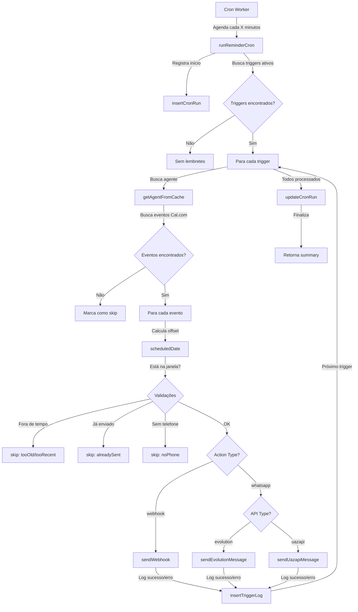

# Análise do Sistema de Lembretes e Cron

## 📋 Índice
1. [Visão Geral](#visão-geral)
2. [Arquitetura do Sistema](#arquitetura-do-sistema)
3. [Fluxo de Execução](#fluxo-de-execução)
4. [Componentes Principais](#componentes-principais)
5. [Banco de Dados](#banco-de-dados)
6. [APIs e Endpoints](#apis-e-endpoints)
7. [Configurações Ambientais](#configurações-ambientais)
8. [Pontos de Atenção](#pontos-de-atenção)
9. [Estrutura de Pastas](#estrutura-de-pastas)

---

## Visão Geral

O sistema de lembretes da impa-ai é um **worker/cron scheduler** que monitora eventos de calendário (Cal.com) e dispara lembretes via **webhook** ou **mensagens WhatsApp** nos horários programados.

### Características Principais:
- ✅ **Agendamento baseado em cron**: Execução periódica configurável
- ✅ **Suporte a múltiplas ações**: Webhooks e mensagens WhatsApp
- ✅ **Dry-run mode**: Testes sem efeitos reais
- ✅ **Logging detalhado**: Rastreamento de cada tentativa
- ✅ **Tolerância temporal**: Janelas configuráveis para evitar duplicidade
- ✅ **Período de carência**: Evita disparos em gatilhos muito recentes

---

## Arquitetura do Sistema

### Componentes Principais:

```
┌─────────────────────────────────────────┐
│   Cron Worker (Node.js + node-cron)     │
│   reminder-cron-worker.ts               │
└──────────────┬──────────────────────────┘
               │
               ├─→ POST /api/internal/reminders/run (trigger manual)
               └─→ GET  /api/admin/reminders/cron (status)
               
               ↓
┌─────────────────────────────────────────┐
│   Core Executor                         │
│   lib/reminders/run-reminder-cron.ts    │
│   - Busca triggers ativos               │
│   - Processa agentes                    │
│   - Dispara lembretes                   │
│   - Registra logs                       │
└──────────────┬──────────────────────────┘
               │
               ├─→ Supabase (PostgreSQL)
               │   - reminder_triggers
               │   - reminder_trigger_logs
               │   - reminder_cron_runs
               │
               ├─→ Cal.com API
               │   - Busca eventos e bookings
               │
               ├─→ WhatsApp API (Evolution/Uazapi)
               │   - Envia mensagens
               │
               └─→ Webhooks customizados
                   - Notificações externas

               ↓
┌─────────────────────────────────────────┐
│   Interface de Monitoramento            │
│   - CronMonitor (React Component)       │
│   - Admin Dashboard                     │
│   - User Dashboard                      │
└─────────────────────────────────────────┘
```

---

## Fluxo de Execução

### 1. **Inicialização do Worker**

```typescript
// scripts/reminder-cron-worker.ts
cron.schedule(schedule, () => {
  void executeRun("cron")
}, { timezone: process.env.REMINDER_CRON_TIMEZONE })
```

**Ações:**
- Lê a agenda (ex: `0 * * * *` = cada hora)
- Define timezone (padrão: America/Sao_Paulo)
- Executa na inicialização (se `REMINDER_CRON_RUN_ON_START !== "0"`)

---

### 2. **Execução do Cron**

```typescript
// lib/reminders/run-reminder-cron.ts: runReminderCron()
```

**Passos principais:**

1. **Início**: `insertCronRun()` - Registra na tabela `reminder_cron_runs`
2. **Busca de Triggers**: 
   - GET `/rest/v1/reminder_triggers?is_active=eq.true`
   - Filtra por `is_active = true`
3. **Processamento por Agente**:
   - Para cada agente com triggers ativos
   - Busca configurações de calendário (Cal.com)
   - Busca conexão WhatsApp (se necessário)
4. **Busca de Eventos**:
   - Chama Cal.com API para buscar bookings
   - Normaliza dados do evento
5. **Processamento de Gatilhos**:
   - Para cada trigger do agente
   - Calcula horário de disparo: `event.start - offset_minutes`
   - Verifica se está na janela de tolerância
   - Valida período de carência (grace period)
6. **Ação de Disparo**:
   - **Webhook**: POST com payload estruturado
   - **WhatsApp**: Envia via Evolution ou Uazapi
7. **Logging**: Registra em `reminder_trigger_logs`
8. **Finalização**: `updateCronRun()` - Atualiza status e métricas

---

## Componentes Principais

### 1. **Worker: `scripts/reminder-cron-worker.ts`**

**Responsabilidade**: Agendador de tarefas

```typescript
// Configurações
- REMINDER_CRON_SCHEDULE: "0 * * * *" (cada hora)
- REMINDER_CRON_TIMEZONE: "America/Sao_Paulo"
- REMINDER_CRON_DRY_RUN: "0" (desativado)
- REMINDER_CRON_RUN_ON_START: "1" (executar na inicialização)
```

**Logs**:
```
[reminder-cron][ISO] Executando cron disparado por cron
[reminder-cron][ISO] Execução concluída
```

---

### 2. **Core: `lib/reminders/run-reminder-cron.ts` (1463 linhas)**

**Módulos internos**:

| Função | Responsabilidade |
|--------|------------------|
| `runReminderCron()` | Orquestrador principal |
| `fetchReminders()` | Busca triggers do Supabase |
| `fetchAgentDetails()` | Cache de dados de agentes |
| `fetchCalendarEvents()` | Chamadas a Cal.com |
| `processTrigger()` | Lógica de disparo |
| `sendWebhook()` | Dispara webhooks |
| `sendUazapiMessage()` | Envia via Uazapi |
| `sendEvolutionMessage()` | Envia via Evolution |
| `insertCronRun()` | Registra início |
| `updateCronRun()` | Registra conclusão |
| `insertTriggerLog()` | Registra disparo |

**Configurações**:
```typescript
TOLERANCE_MINUTES = 5          // Janela para considerar "agora"
REQUEST_TIMEOUT_MS = 10000     // Timeout de requisições
MAX_LOOKBACK_MINUTES = 720     // 12 horas - eventos antigos
TRIGGER_GRACE_PERIOD_MS = 5min // Período de carência
```

---

### 3. **API: `app/api/internal/reminders/run/route.ts`**

**Endpoint para trigger manual**:
```
POST /api/internal/reminders/run
Headers:
  x-reminder-cron-secret: ${REMINDER_CRON_SECRET}
  x-dry-run: "1" (opcional)

Response:
{
  success: true,
  summary: CronSummary
}
```

---

### 4. **Admin API: `app/api/admin/reminders/cron/route.ts`**

**Endpoint para monitorar status**:
```
GET /api/admin/reminders/cron

Response:
{
  success: true,
  schedule: "0 * * * *",
  timezone: "America/Sao_Paulo",
  dryRun: false,
  serverTime: "2025-11-11T10:30:00Z",
  lastRuns: [...],
  nextRuns: [...]
}
```

**Funcionalidades**:
- Calcula próximas execuções usando `cron-parser`
- Busca histórico dos últimos 5 runs
- Fallback para parser sem timezone (se necessário)

---

### 5. **Interface: `components/reminders/cron-monitor.tsx`**

**Componente React** para Admin Dashboard

**Features**:
- 📊 Exibe agendamento e timezone
- 🔄 Próximas 5 execuções programadas
- 📈 Últimas 5 execuções com status
- 🎯 Métricas de cada run:
  - Duração
  - Gatilhos processados
  - Lembretes agendados
  - Lembretes enviados
  - Falhas
- 🔄 Botão "Atualizar"
- ⚠️ Modo dry-run indicado

---

## Banco de Dados

### Tabelas Principais

#### 1. **`reminder_triggers`**

```sql
CREATE TABLE impaai.reminder_triggers (
  id UUID PRIMARY KEY,
  agent_id UUID NOT NULL,           -- Qual agente
  offset_amount INTEGER NOT NULL,   -- Quanto tempo antes
  offset_unit TEXT NOT NULL,        -- 'minutes', 'hours', 'days'
  action_type TEXT NOT NULL,        -- 'webhook' ou 'whatsapp_message'
  webhook_url TEXT,                 -- URL para webhook
  action_payload JSONB,             -- Payload para WhatsApp
  is_active BOOLEAN NOT NULL,       -- Ativado?
  created_at TIMESTAMPTZ,           -- Criação
  updated_at TIMESTAMPTZ            -- Última modificação
);

Índices:
- reminder_triggers_agent_idx
- reminder_triggers_active_idx

Trigger:
- update_reminder_triggers_updated_at (auto-update)
```

**Relações com Action Type**:

```sql
-- action_type = 'webhook'
- webhook_url MUST NOT NULL

-- action_type = 'whatsapp_message'
- action_payload contém:
  {
    version: number (ex: 2024-08-13)
    channel: 'participant' | 'custom'
    customNumber: string | null
    templateId: string | null
    templateText: string | null
  }
```

---

#### 2. **`reminder_trigger_logs`**

```sql
CREATE TABLE impaai.reminder_trigger_logs (
  id UUID PRIMARY KEY,
  trigger_id UUID NOT NULL,                -- Qual trigger disparou
  booking_uid TEXT NOT NULL,              -- ID do evento
  scheduled_for TIMESTAMPTZ NOT NULL,     -- Quando foi agendado
  executed_at TIMESTAMPTZ NOT NULL,       -- Quando foi executado
  success BOOLEAN NOT NULL,                -- Sucesso?
  webhook_status INTEGER,                 -- HTTP status (se webhook)
  webhook_response JSONB,                 -- Resposta (se webhook)
  error_message TEXT,                     -- Mensagem de erro
  created_at TIMESTAMPTZ                  -- Registro criado
);

Índices:
- reminder_trigger_logs_unique_idx (trigger_id, booking_uid)
- reminder_trigger_logs_trigger_idx

Contraint:
- UNIQUE(trigger_id, booking_uid) - Evita duplicidade
```

**Propósito**: Rastreamento de cada disparo, auditoria e detecção de duplicatas.

---

#### 3. **`reminder_cron_runs`**

```sql
CREATE TABLE impaai.reminder_cron_runs (
  id UUID PRIMARY KEY,
  started_at TIMESTAMPTZ NOT NULL,        -- Início da execução
  finished_at TIMESTAMPTZ,                -- Fim da execução
  duration_ms INTEGER,                    -- Tempo total (ms)
  success BOOLEAN,                        -- Sucesso?
  dry_run BOOLEAN NOT NULL,               -- Era um dry-run?
  reminders_due INTEGER NOT NULL,         -- Quantas estavam vencidas
  reminders_sent INTEGER NOT NULL,        -- Quantas foram enviadas
  reminders_failed INTEGER NOT NULL,      -- Quantas falharam
  triggers_processed INTEGER NOT NULL,    -- Quantos triggers processados
  message TEXT,                           -- Mensagem (se erro)
  details JSONB,                          -- Detalhes de cada trigger
  created_at TIMESTAMPTZ
);

Índices:
- reminder_cron_runs_started_idx (started_at DESC)
```

**Propósito**: Histórico de execuções do cron para monitoramento e debugging.

---

### Diagrama de Relações

```
ai_agents
    ↓
reminder_triggers (agent_id FK)
    ├─→ reminder_trigger_logs (trigger_id FK)
    │        └─→ Rastreia cada disparo
    │
    └─→ reminder_cron_runs
             └─→ Agrega métricas de cada execução
```

---

## APIs e Endpoints

### Endpoints do Sistema de Reminders

| Método | Rota | Autenticação | Responsabilidade |
|--------|------|--------------|-----------------|
| POST/GET | `/api/internal/reminders/run` | REMINDER_CRON_SECRET | Executar cron manualmente |
| GET | `/api/admin/reminders/cron` | User admin | Ver status do cron |
| GET | `/app/admin/reminders` | UI | Página de admin |
| GET | `/app/dashboard/reminders` | UI | Página de usuário |
| GET | `/app/admin/settings/cron` | UI | Monitor do cron |

### Integração com Cal.com

**Endpoints chamados**:
```typescript
GET ${calendarApiUrl}/bookings
GET ${calendarApiUrl}/bookings/${bookingUid}
```

**Campos esperados**:
- `startTime`/`start` - Horário do evento
- `attendees[].phone` - Telefone do participante
- `eventType?.slug` - Identificador do tipo de evento
- `eventType?.timeZone` - Timezone do evento

---

## Configurações Ambientais

### Variáveis Obrigatórias

```bash
# Supabase
SUPABASE_URL=https://...supabase.co
SUPABASE_SERVICE_ROLE_KEY=eyJ...

# Segurança
REMINDER_CRON_SECRET=seu-segredo-aqui
```

### Variáveis Opcionais (com defaults)

```bash
# Agendamento
REMINDER_CRON_SCHEDULE="0 * * * *"           # Cada hora
REMINDER_CRON_TIMEZONE="America/Sao_Paulo"   # Timezone
REMINDER_CRON_DRY_RUN="0"                    # Desativado (0=true, 1=false - ATENÇÃO!)
REMINDER_CRON_RUN_ON_START="1"               # Executar ao iniciar

# Tolerâncias
REMINDER_CRON_TOLERANCE_MINUTES="5"          # Janela de 5 minutos
REMINDER_CRON_TIMEOUT_MS="10000"             # Timeout de 10s
REMINDER_CRON_MAX_LOOKBACK_MINUTES="720"     # 12 horas atrás
REMINDER_TRIGGER_GRACE_MINUTES="5"           # Período de carência

# WhatsApp (Evolution)
EVOLUTION_BASE_URL=https://...
EVOLUTION_API_KEY=...

# WhatsApp (Uazapi)
UAZAPI_BASE_URL=https://...
UAZAPI_API_KEY=...
```

---

## Pontos de Atenção

### 1. **Timestamps e Timezones** ⚠️

**Problema resolvido** (migration `20251110_fix_reminder_timestamps.sql`):
- Timestamps salvos como local mas interpretados como UTC
- Solução: `ALTER DEFAULT` e reinterpretar registros existentes

**Status Atual**:
- ✅ Defaults usando `now()` (servidor UTC)
- ✅ Registro corrigido via migration

**Recomendação**:
- Sempre usar `now()` nos defaults
- Sempre armazenar em UTC (TIMESTAMPTZ)
- Converter para exibição conforme necessário

---

### 2. **Segredo do Cron** 🔐

```typescript
// Validação obrigatória
export async function requireCronSecret(request: Request) {
  const configuredSecret = process.env.REMINDER_CRON_SECRET
  if (!configuredSecret) {
    throw new Error("REMINDER_CRON_SECRET não configurada")
  }
  
  const header = request.headers.get("x-reminder-cron-secret")
  if (header !== configuredSecret) {
    throw new Error("Segredo inválido")
  }
}
```

**Uso**:
```bash
curl -X POST http://localhost:3000/api/internal/reminders/run \
  -H "x-reminder-cron-secret: seu-segredo"
```

---

### 3. **Detecção de Duplicidade** 🔄

```sql
-- UNIQUE INDEX impede duplicatas
CREATE UNIQUE INDEX reminder_trigger_logs_unique_idx
  ON impaai.reminder_trigger_logs(trigger_id, booking_uid)
```

**Lógica**:
- Mesma combinação (trigger + booking) = mesma tentativa
- Se já existe log, atualiza (não duplica)
- Tolerância de 5 minutos para "agora"

---

### 4. **Período de Carência (Grace Period)** ⏳

```typescript
const TRIGGER_GRACE_PERIOD_MS = 
  Math.max(0, Number(process.env.REMINDER_TRIGGER_GRACE_MINUTES ?? "5")) * 60 * 1000

// Gatilho criado há menos de 5 minutos? Ignora
const activationTimestamp = Math.max(createdAtMs, updatedAtMs)
if (now - activationTimestamp < TRIGGER_GRACE_PERIOD_MS) {
  // Skip
}
```

**Propósito**: Evitar disparo durante janela de criação/edição

---

### 5. **Modo Dry-Run** 🧪

```typescript
// Não atualiza logs, não envia mensagens reais
if (!dryRun) {
  await insertTriggerLog(...)
  await sendWebhook(...)  // ou WhatsApp
}
```

**Uso**:
```bash
curl -X POST http://localhost:3000/api/internal/reminders/run \
  -H "x-reminder-cron-secret: seu-segredo" \
  -H "x-dry-run: 1"
```

---

### 6. **Cache de Agentes** 📦

```typescript
const agentCache = new Map<string, AgentRecord>()

// Evita múltiplas chamadas ao mesmo agente
function getAgentFromCache(agentId: string) {
  if (agentCache.has(agentId)) {
    return agentCache.get(agentId)!
  }
  // Busca no Supabase
  const agent = await fetchAgentDetails(agentId)
  agentCache.set(agentId, agent)
  return agent
}
```

---

### 7. **Tipos de Ações** 🎯

#### a) **Webhook**
```typescript
// Requer webhook_url
// Envia POST com payload estruturado
await sendWebhook(trigger.webhook_url, {
  attendeeName: string,
  attendeePhone: string,
  api: "evo" | "uazapi",
  instanceName: string,
  instanceApiKey: string,
  apiUrl: string,
  meetingTime: ISO string,
  meetingTimeOffset: string,
  videoCallUrl?: string
})
```

#### b) **WhatsApp Message**
```typescript
// Via Evolution ou Uazapi
// Requer action_payload com configuração
const config: WhatsappMessageActionConfig = {
  version: 2024-08-13,
  channel: "participant" | "custom",
  customNumber?: string,
  templateId?: string,
  templateText?: string
}
```

---

## Estrutura de Pastas

```
impa-ai/
├── lib/reminders/
│   └── run-reminder-cron.ts          [CORE] Lógica principal (1463 linhas)
│
├── app/
│   ├── api/
│   │   ├── internal/reminders/run/   [INTERNAL API] Trigger manual
│   │   │   └── route.ts
│   │   └── admin/reminders/cron/     [ADMIN API] Status do cron
│   │       └── route.ts
│   ├── admin/reminders/
│   │   └── page.tsx                  [UI] Página admin
│   ├── admin/settings/cron/
│   │   └── page.tsx                  [UI] Monitor do cron
│   └── dashboard/reminders/
│       └── page.tsx                  [UI] Página user
│
├── components/reminders/
│   ├── cron-monitor.tsx              [COMPONENT] Monitor React
│   ├── booking-reminders-view.tsx    [COMPONENT] Visualização de lembretes
│   └── [outros componentes]
│
├── scripts/
│   ├── reminder-cron-worker.ts       [WORKER] Agendador Node.js
│   ├── run-cron-once.ts              [CLI] Executar uma vez
│   ├── run-reminder-cron-once.ts     [CLI] Alias
│   └── test-reminder-cron.ts         [TEST] Testes unitários
│
├── database/
│   ├── create_reminder_triggers_table.sql
│   ├── create_reminder_trigger_logs_table.sql
│   ├── create_reminder_cron_runs_table.sql
│   ├── 20251110_fix_reminder_timestamps.sql
│   └── 20251111_add_whatsapp_message_trigger.sql
│
└── docs/
    └── REMINDERS_CRON_SYSTEM_ANALYSIS.md [ESTE DOCUMENTO]
```

---

## Fluxograma Completo



---

## Checklist de Funcionalidades

- [x] Agendamento automático (node-cron)
- [x] Dry-run mode para testes
- [x] Suporte a webhooks
- [x] Suporte a WhatsApp (Evolution + Uazapi)
- [x] Logging detalhado de tentativas
- [x] Detecção de duplicidade
- [x] Período de carência para gatilhos novos
- [x] Cache de agentes
- [x] Tolerância temporal configurável
- [x] Integração com Cal.com
- [x] Interface de monitoramento
- [x] Admin dashboard
- [x] User dashboard
- [x] Histórico de execuções
- [x] Cálculo de próximas execuções

---

## Próximos Passos Recomendados

1. **Monitoramento em Produção**:
   - Usar logs estruturados (JSON)
   - Integração com ferramentas como Datadog/New Relic

2. **Escalabilidade**:
   - Considerar migração para Job Queue (Bull, RabbitMQ)
   - Balanceamento entre múltiplos workers

3. **Resiliência**:
   - Retry logic com backoff exponencial
   - Circuit breaker para APIs externas

4. **Performance**:
   - Otimizar queries ao Cal.com (pagination, filtering)
   - Batch processing de lembretes

---

**Última atualização**: 11 de novembro de 2025
**Documentação atualizada por**: GitHub Copilot
